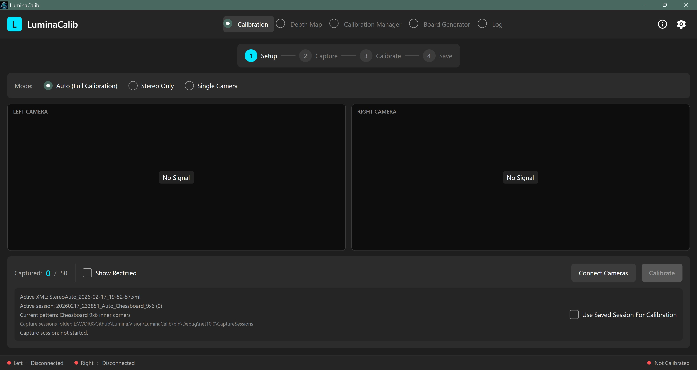
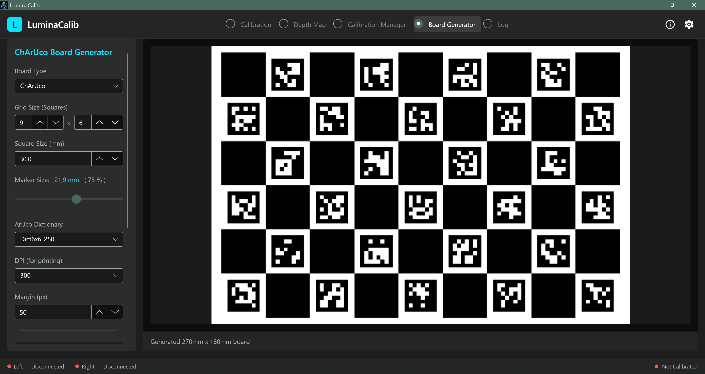

# LuminaCalib

[](LICENSE)
[](https://dotnet.microsoft.com/en-us/download/dotnet/10.0)
[](https://github.com/Smithbox-ai/Lumina.Vision/actions/workflows/ci.yml)

**LuminaCalib** is a cross-platform stereo camera calibration application built with .NET 10 and Avalonia UI. It solves the frame synchronization problem common in legacy calibration tools by using a producer-consumer pipeline with timestamp matching, ensuring physically synchronized frame pairs are used for calibration.

---

## Screenshots

| | |
|---|---|
|  |  |

---

## Features

- **Stereo calibration** — synchronized L/R frame capture with timestamp matching (< 20 ms tolerance)
- **Single-camera calibration** — intrinsic parameter computation for each camera independently
- **Real-time rectification** — live preview of rectified frames immediately after calibration
- **Depth map generation** — StereoSGBM + WLS filtering, optional CUDA acceleration, 10 colormaps, PLY point cloud export
- **ChArUco board generator** — PDF, SVG, and high-res PNG export with configurable dictionaries and DPI
- **RTSP camera support** — UDP/TCP transport, HW acceleration (NVDEC, VAAPI, QuickSync), automatic CPU fallback
- **Calibration library** — file-watcher-backed manager for calibration sessions and result files
- **Cross-platform** — Windows and Linux (Ubuntu 24.04+)

---

## Prerequisites

- [.NET 10 SDK](https://dotnet.microsoft.com/en-us/download/dotnet/10.0)
- RTSP-accessible cameras or a compatible RTSP stream source
- *(Optional)* CUDA-capable GPU for accelerated depth map computation

---

## Build & Run

```sh
# Clone the repository
git clone https://github.com/Smithbox-ai/Lumina.Vision.git
cd Lumina.Vision

# Build
dotnet build

# Run
dotnet run --project LuminaCalib
```

---

## Running Tests

```sh
dotnet test
```

---

## Project Structure

```
LuminaCalib/
├── Calibration/       # OpenCV calibration engine, corner detection, rectification
├── Controls/          # Custom Avalonia controls (VideoView, WorkflowStepper, …)
├── Devices/           # Camera abstraction (ICameraSource, AsyncFrameReader)
├── Models/            # Data models (AppSettings, CalibrationResult, FrameRaw, …)
├── Services/          # Application services (StereoSynchronizer, DepthMapService, …)
├── ViewModels/        # MVVM ViewModels (CommunityToolkit.Mvvm)
├── Views/             # Avalonia XAML views
├── Styles/            # App-wide style resources
└── doc/
    └── developer-guide.md   # Detailed developer documentation

LuminaCalib.Tests/     # xUnit test suite (Avalonia.Headless)
```

For a detailed architectural overview, see [LuminaCalib/doc/developer-guide.md](LuminaCalib/doc/developer-guide.md).

---

## License

Licensed under the [Apache License, Version 2.0](LICENSE).

**Attribution:** This project is derived from the original work at
[https://git.tocan.com.ua/Stanislav_Maslenkov/stand_msi.git](https://git.tocan.com.ua/Stanislav_Maslenkov/stand_msi.git)

---

## Contributing

See [CONTRIBUTING.md](CONTRIBUTING.md). Please read our [Code of Conduct](CODE_OF_CONDUCT.md) before contributing.

---
---

## На русском

**LuminaCalib** — кроссплатформенное приложение для калибровки стереокамер на .NET 10 и Avalonia UI. Решает проблему рассинхронизации кадров в традиционных инструментах: архитектура producer-consumer с сопоставлением временных меток (допуск < 20 мс) гарантирует использование физически синхронизированных пар кадров.

---

## Возможности

- **Стерео-калибровка** — синхронный захват пар кадров L/R с сопоставлением по меткам времени
- **Однокамерная калибровка** — вычисление внутренних параметров для каждой камеры отдельно
- **Ректификация в реальном времени** — мгновенный просмотр исправленных кадров после калибровки
- **Карта глубины** — StereoSGBM + WLS-фильтрация, опциональное CUDA-ускорение, 10 цветовых карт, экспорт PLY point cloud
- **Генератор ChArUco-досок** — экспорт в PDF, SVG и PNG с настраиваемыми словарями и DPI
- **Поддержка RTSP-камер** — UDP/TCP транспорт, аппаратное ускорение (NVDEC, VAAPI, QuickSync), автоматический CPU fallback
- **Библиотека калибровок** — менеджер сессий и результатов с автообновлением через FileWatcher
- **Кроссплатформенность** — Windows и Linux (Ubuntu 24.04+)

---

## Требования

- [.NET 10 SDK](https://dotnet.microsoft.com/en-us/download/dotnet/10.0)
- Камеры с доступом по RTSP или совместимый RTSP-источник
- *(Опционально)* GPU с поддержкой CUDA для ускоренного построения карты глубины

---

## Сборка и запуск

```sh
git clone https://github.com/Smithbox-ai/Lumina.Vision.git
cd Lumina.Vision

dotnet build
dotnet run --project LuminaCalib
```

---

## Тесты

```sh
dotnet test
```

---

## Структура проекта

```
LuminaCalib/
├── Calibration/       # Движок калибровки OpenCV, определение углов, ректификация
├── Controls/          # Пользовательские элементы управления Avalonia
├── Devices/           # Абстракция камер (ICameraSource, AsyncFrameReader)
├── Models/            # Модели данных
├── Services/          # Сервисы (StereoSynchronizer, DepthMapService и др.)
├── ViewModels/        # MVVM ViewModels (CommunityToolkit.Mvvm)
├── Views/             # XAML-представления
└── doc/
    └── developer-guide.md   # Подробная документация для разработчиков

LuminaCalib.Tests/     # Тесты xUnit (Avalonia.Headless)
```

Подробное описание архитектуры: [LuminaCalib/doc/developer-guide.md](LuminaCalib/doc/developer-guide.md).

---

## Лицензия

Лицензировано на условиях [Apache License 2.0](LICENSE).

---

## Вклад в проект

[CONTRIBUTING.md](CONTRIBUTING.md) — руководство по внесению изменений.
Пожалуйста, ознакомьтесь с [Кодексом поведения](CODE_OF_CONDUCT.md).
